# Overview
The project focuses on economic analysis of two countries India and USA. We have predicted certain indicators that are required for determining economic growth of a country. Based on the values of economic indicators, we have predicted whether we will face any recession in upcoming 10 years for both countries. Also, we have compared two economies.

# Steps:
1)   Data Scraping and wrangling
2)   Missing Values
3)   Parameter Selection
4)   Building Models
5)   Deploying Web Service
6)   Deploy application on cloud 

---
# 1) Data Scraping and wrangling
Firstly, we did research on the economy indicators. We determined what all indicators can impact an economy of a nation. We scraped the data from https://fred.stlouisfed.org/. 

We have used library fredr and api key is created on fred.stlouis website. Fredr method is used to scrape data from website where we have mentioned the start date, end date and frequency = ”quarter”. We have taken data quarterly for all the selected indicators.

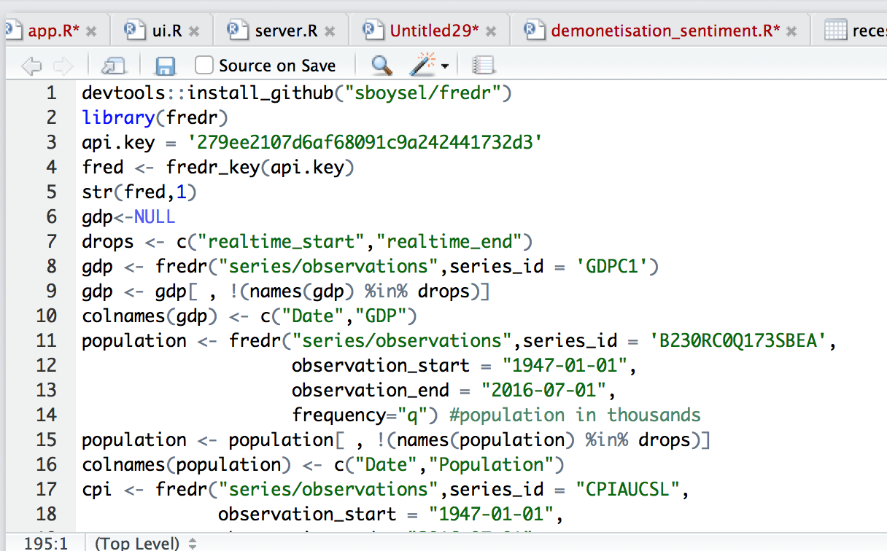

# 2) Missing Values
Some of the data was not available for inflation rate and unemployment rate. To fill in the missing inflation rates values, we have taken percent change of cpi between two quarters to determine inflation rate for the present quarter.

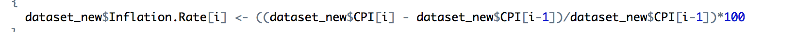

The missing unemployment rate was taken as mean of the column: 
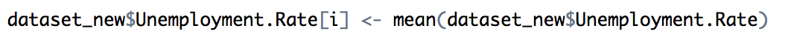

# 3) Parameter Selection:
We founded one new parameter selection package “Boruta” package. Boruta is a feature selection algorithm. Precisely, it works as a wrapper algorithm around Random Forest.

**How it Works?**

1.  Firstly, it adds randomness to the given data set by creating shuffled copies of all features (which are called shadow features).
2.  Then, it trains a random forest classifier on the extended data set and applies a feature importance measure (the default is Mean Decrease Accuracy) to evaluate the importance of each feature where higher means more important.
3.  At every iteration, it checks whether a real feature has a higher importance than the best of its shadow features (i.e. whether the feature has a higher Z score than the maximum Z score of its shadow features) and constantly removes features which are deemed highly unimportant.
4.  Finally, the algorithm stops either when all features gets confirmed or rejected or it reaches a specified limit of random forest runs.

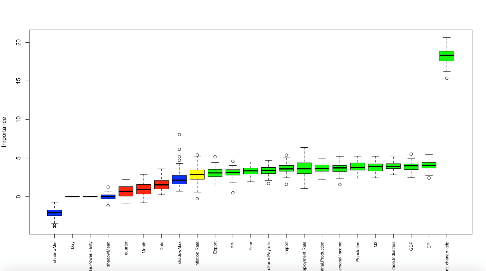

The graph is plotted where green boxes indicate the important parameters, yellow represents average indicators and blue, red shows those indicators that are do not have any importance in predicting recession.
Based on the above graph, we have selected those parameters that are green boxes as they have more significance.

# Predicting the economic indicators for 10 years:
As our dataset is time series, we have used ARIMA model. ARIMA model is used for 
When dealing with ARIMA models, we have to follow 4 steps:
1.  Visualize the time series
2.  Stationarize the time series
3.  Plot ACF/PACF charts and find optimal parameters
4.  Build the ARIMA model
5.  Make predictions

Step 1: Visualize the time series
It is essential to analyze the trends prior to building any kind of time series model. The details we are interested in pertains to any kind of trend, seasonality or random behaviour in the series. In our dataset we have examined seasonal pattern.

Step2: Stationarize the time series
We need to check if the series is stationary or not. Generally the series should be stationary because time series models work accurate when the series is stationary.
To check that we have to see ACF/PACF charts.

Step3: ACF/PACF charts

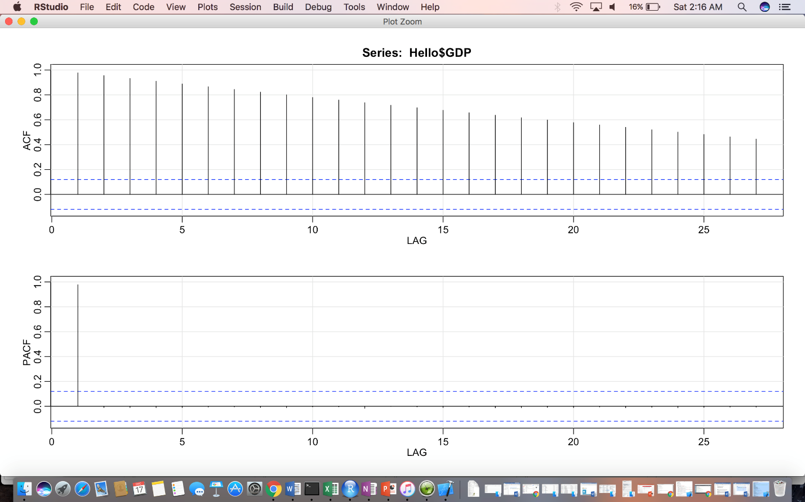

The above graph shows the declining graph which tells GDP is stationary 

Step 4: Build ARIMA models

We run auto.arima on train data to predict best model which will be in terms of (p,d,q). So our best model is ARIMA(2,2,2).

The below screenshot shows ar1, ar2 coefficients that mean our model is good as our values are below 1.
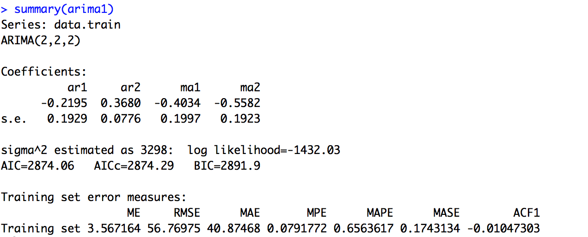

Now we have forecasted the values using our best model :

# Azure ML Time Series for forecasting:
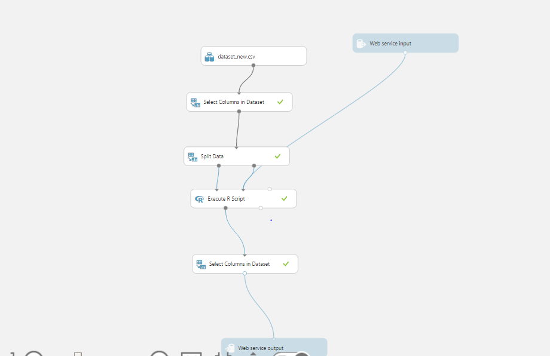

1.  Uploaded dataset
2.  Select columns like year, quarter as input parameters
3.  Split data. The data is trained before Year 2015

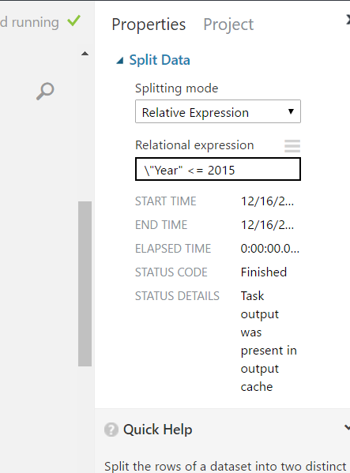

4. Execute R script. We have written our script where h=40 that is taking 40 quarters

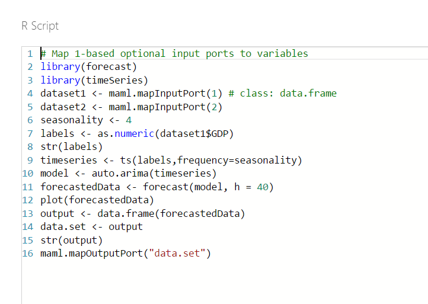

# Azure ML Studio
Read the consolidated csv file.
Select the desired column GDP, Population, CPI, PPI Import,M2,Unemployment rate, Real Personal Income, Industrial Production, Recession, Export predicted/Classification values 

# Azure Modules

**Split Data** -To split a dataset into two equal parts, just add the Split Data module after the dataset without no other changes. By default, the module splits the dataset in two equal parts. For data with an odd number of rows, the second output gets the remainder.

**Train Model** - Training a classification or regression model is a kind of supervised machine learning. That means you must provide a dataset that contains historical data from which to learn patterns. The data should contain both the outcome you are trying to predict, and related factors (variables). The machine learning model uses the data to extract statistical patterns and build a model.

When you configure Train Model, you must also connect an already configured model, such as a regression algorithm, decision tree model, or another machine learning module.

**Score Model** - Score Model is used to generate predictions using a trained classification or regression model. The predicted value can be in many different formats, depending on the model and your input data: If you are using a classification model to create the scores, Score Model outputs a predicted value for the class, as well as the probability of the predicted value. For regression models, Score Model generates just the predicted numeric value.

**Evaluate Model** - Evaluate Model is used to measure the accuracy of a trained classification model or regression model. You provide a dataset containing scores generated from a trained model, and the Evaluate Model module computes a set of industry-standard evaluation metrics. The metrics returned by Evaluate Model depend on the type of model that you are evaluating    

# Classification Models
We build three classification model to classify Predicted Values into Yes (recession) and No (not a recession) and compare those models among them to find the best classification algorithm as per our model

## Two class Decision Forest
The decision forest algorithm is an ensemble learning method for classification. The algorithm works by building multiple decision trees and then voting on the most popular output class. Voting is a form of aggregation, in which each tree in a classification decision forest outputs a non-normalized frequency histogram of labels. 

## Two class Neural network
A neural network is a set of interconnected layers, in which the inputs lead to outputs by a series of weighted edges and nodes. The weights on the edges are learned when training the neural network on the input data. The direction of the graph proceeds from the inputs through the hidden layer, with all nodes of the graph connected by the weighted edges to nodes in the next layer. Most predictive tasks can be accomplished easily with only one or a few hidden layers.

Recent research has shown that deep neural networks (DNN) can be very effective in complex tasks such as image or speech recognition, in which successive layers are used to model increasing levels of semantic depth. To compute the output of the network for any given input, a value is calculated for each node in the hidden layers and in the output layer. For each node, the value is set by calculating the weighted sum of the values of the nodes in the previous layer and applying an activation function to that weighted sum.

## Two class Logistic Regression
Logistic regression is a well-known method in statistics that is used to predict the probability of an outcome, and is especially popular for classification tasks. The algorithm predicts the probability of occurrence of an event by fitting data to a logistic function.
Logistic regression requires numeric variables. Therefore, when you use categorical columns as variable, Azure Machine Learning converts the values to an indicator array internally.

### Azure Model

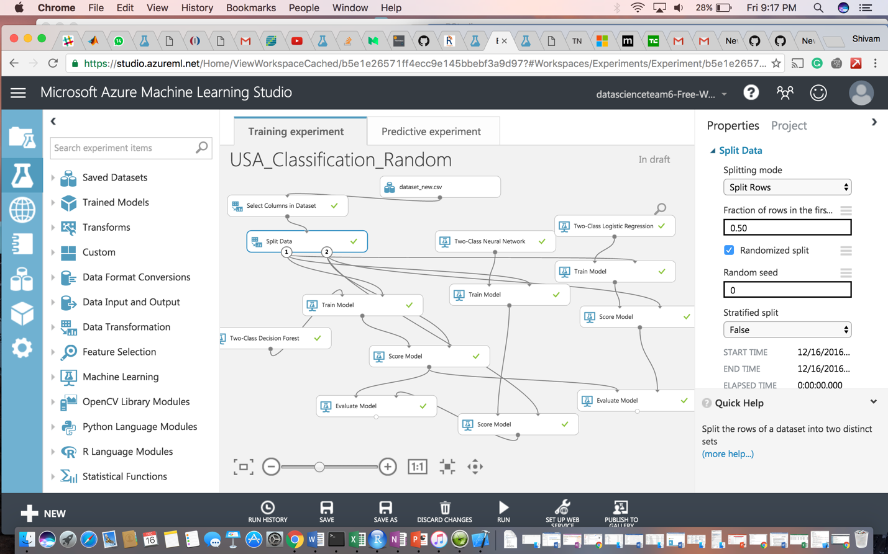

**ROC curve**

The ROC curve plots the pairs {sensitivity, 1-specificity} as the cutoff value increases from 0 and 1

•   Sensitivity (also called the true positive rate, or the recall in some fields) measures the proportion of positives that are correctly identified (e.g., the percentage of sick people who are correctly identified as having the condition).

•   Specificity (also called the true negative rate) measures the proportion of negatives that are correctly identified

as such (e.g., the percentage of healthy people who are correctly identified as not having the condition).

• Better performance is reflected by curves that are closer to the top left corner

**Confusion Matrix and other performance metrics:**

The following statistics are shown for our model:

* **Mean Absolute Error (MAE)**: The average of absolute errors (an error is the difference between the predicted value and the actual value).

* **Root Mean Squared Error (RMSE):** The square root of the average of squared errors of predictions made on the test dataset.

* **Relative Absolute Error:** The average of absolute errors relative to the absolute difference between actual values and the average of all actual values.

* **Relative Squared Error:** The average of squared errors relative to the squared difference between the actual values and the average of all actual values.

* **Coefficient of Determination:** Also known as the R squared value, this is a statistical metric indicating how well a model fits the data.

For each of the error statistics, smaller is better. A smaller value indicates that the predictions more closely match the actual values. For Coefficient of Determination, the closer its value is to one (1.0), the better the predictions.

Comparing between Random forest and Neural Network classification 

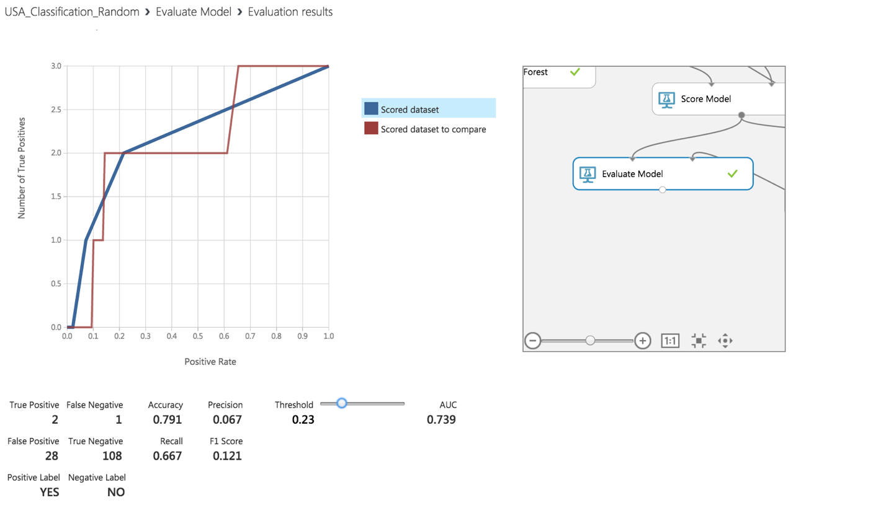

Comparing between Random forest and Logistic Regression classification

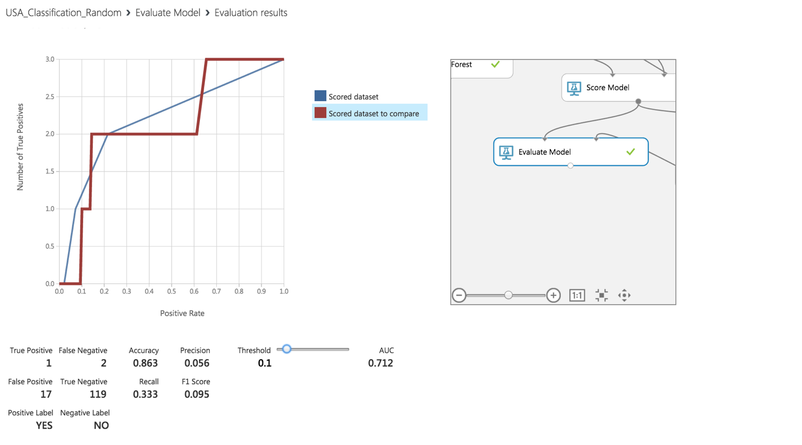

# Web Service
•   Once the classification model is ready, we set up Web Service.
•   The model we trained is saved as a single Trained Model module into the module palette to the left of the experiment canvas (you can find it under Trained Models)
•   Then we added the saved trained model back into the experiment.
•   Web service input and Web service output modules are added

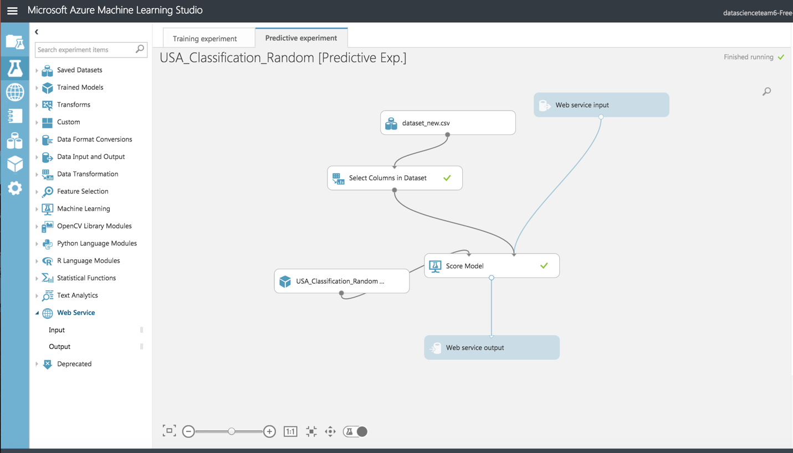

•   Now run the model and publish the web service

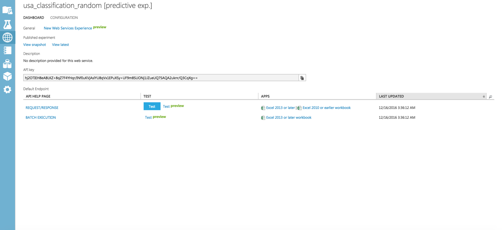
•   On running the web service, we get the following form which can be used to invoke the web service and do prediction.

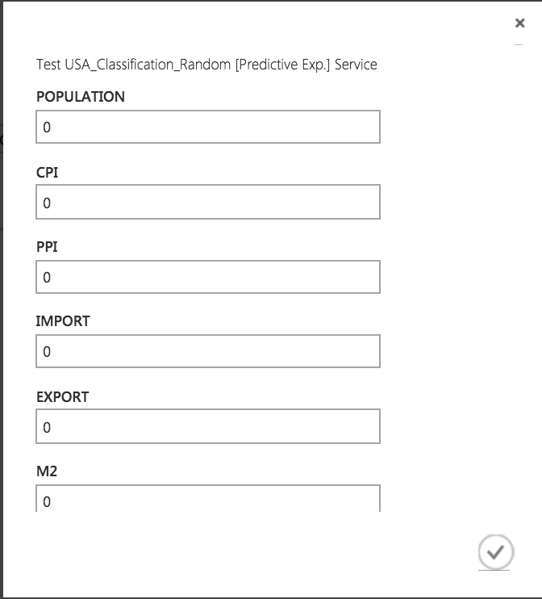

# Conclusion: 
Thus from above it’s clear that the best model among the classification models is Two class Decision Tree as it has high accuracy rate at 86.3%. Also, the Area Under Curve (AUC) is highest in Two class Decision Tree.

